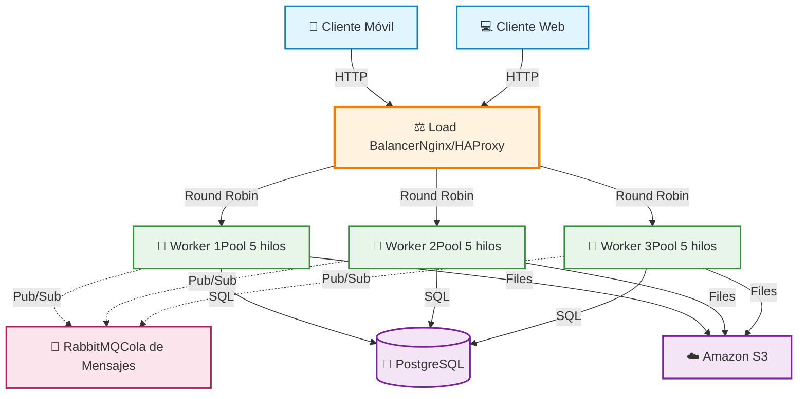

# Diagrama del Sistema Distribuido - PFO3

## Arquitectura Cliente-Servidor con Componentes Distribuidos



---

## 📋 Descripción de Flujo

### 1. **Flujo de una Petición Típica:**
```
Cliente → Load Balancer → Worker disponible → Base de Datos → Respuesta al Cliente
```

### 2. **Flujo de una Tarea Asíncrona:**
```
Cliente → Load Balancer → Worker 1 → RabbitMQ (mensaje) → Worker 2 procesa → Base de Datos
```

### 3. **Flujo de Subida de Archivo:**
```
Cliente → Load Balancer → Worker → S3 (archivo) + PostgreSQL (metadata)
```

---

## 🔧 Características Clave del Sistema

### **Alta Disponibilidad**
- Si un worker falla, el Load Balancer redirige a otro
- La cola RabbitMQ garantiza que las tareas no se pierdan

### **Escalabilidad Horizontal**
- Se pueden agregar más workers según la demanda
- El Load Balancer distribuye automáticamente la carga

### **Desacoplamiento**
- Los workers se comunican vía RabbitMQ sin conocerse directamente
- Facilita el mantenimiento y las actualizaciones

### **Pool de Hilos por Worker**
- Cada worker puede procesar múltiples tareas simultáneamente
- Ejemplo: Worker con 5 hilos = 5 tareas en paralelo

---

## 🌐 Puertos Estándar Utilizados

| Componente | Puerto | Protocolo |
|------------|--------|-----------|
| Nginx/HAProxy | 80, 443 | HTTP/HTTPS |
| Workers | 8001-8003 | TCP/HTTP |
| RabbitMQ | 5672 | AMQP |
| PostgreSQL | 5432 | PostgreSQL Protocol |
| S3 | 443 | HTTPS |

---

## 💡 Ventajas de esta Arquitectura

1. **Tolerancia a Fallos**: Si un componente falla, el sistema sigue funcionando
2. **Escalabilidad**: Fácil agregar más recursos según demanda
3. **Mantenimiento**: Se pueden actualizar workers sin detener el servicio
4. **Performance**: Procesamiento paralelo mediante múltiples workers e hilos
5. **Flexibilidad**: Diferentes tipos de almacenamiento según necesidad

---