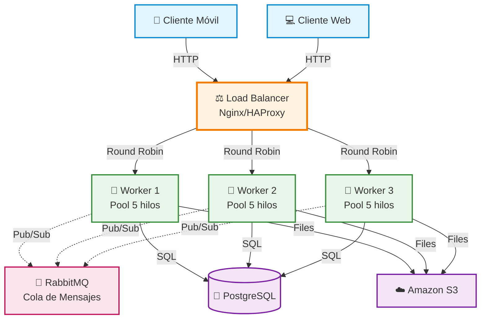

# Diagrama del Sistema Distribuido - PFO3

## Arquitectura Cliente-Servidor con Componentes Distribuidos



---

## 📋 Componentes del Sistema

### 1️⃣ Capa de Clientes
- **Cliente Móvil**: Aplicaciones iOS/Android
- **Cliente Web**: Aplicación en navegador
- **Protocolo**: HTTP/HTTPS o WebSocket

### 2️⃣ Capa de Balanceo
- **Load Balancer** (Nginx o HAProxy)
- **Puerto**: 80 (HTTP) / 443 (HTTPS)
- **Algoritmo**: Round Robin
- **Función**: Distribuir peticiones entre workers

### 3️⃣ Capa de Aplicación
- **Worker 1, 2, 3**: Servidores de procesamiento
- **Pool de Hilos**: 5 hilos por worker (15 tareas simultáneas)
- **Puertos**: 8001, 8002, 8003
- **Función**: Procesar lógica de negocio

### 4️⃣ Capa de Mensajería
- **RabbitMQ**: Sistema de cola de mensajes
- **Puerto**: 5672 (AMQP)
- **Patrón**: Publish/Subscribe
- **Función**: Comunicación asíncrona entre workers

### 5️⃣ Capa de Persistencia
- **PostgreSQL**: Base de datos relacional (Puerto 5432)
  - Datos estructurados (usuarios, pedidos, etc.)
- **Amazon S3**: Almacenamiento de archivos
  - Archivos grandes (imágenes, videos, PDFs)

---

## 🔄 Flujos de Operación

### Flujo 1: Petición Síncrona (Consulta simple)
```
Cliente → Load Balancer → Worker disponible → PostgreSQL → Respuesta
```

**Ejemplo**: Usuario hace login
1. Cliente envía credenciales
2. Load Balancer selecciona Worker 2 (menos carga)
3. Worker 2 consulta PostgreSQL
4. Worker 2 responde con token de sesión

### Flujo 2: Petición Asíncrona (Tarea pesada)
```
Cliente → LB → Worker 1 (respuesta inmediata)
Worker 1 → RabbitMQ (mensaje)
Worker 2 ← RabbitMQ (procesa mensaje)
Worker 2 → PostgreSQL/S3 (guarda resultado)
```

**Ejemplo**: Generar reporte mensual
1. Cliente solicita reporte
2. Worker 1 responde: "En proceso..."
3. Worker 1 envía tarea a RabbitMQ
4. Worker 3 procesa reporte en background
5. Worker 3 guarda PDF en S3
6. Sistema notifica al usuario (email/push)

### Flujo 3: Subida de Archivo
```
Cliente → LB → Worker → S3 (archivo) + PostgreSQL (metadata)
```

**Ejemplo**: Usuario sube foto de perfil
1. Cliente envía imagen
2. Worker 1 recibe archivo
3. Worker 1 sube a S3 → obtiene URL
4. Worker 1 guarda en PostgreSQL: {user_id, photo_url, size, date}
5. Worker 1 envía mensaje a RabbitMQ: "Generar thumbnails"
6. Worker 2 procesa thumbnails en background

---

## ⚡ Ventajas de esta Arquitectura

| Característica | Beneficio |
|----------------|-----------|
| **Alta Disponibilidad** | Si un worker falla, otros continúan |
| **Escalabilidad Horizontal** | Agregar más workers según demanda |
| **Procesamiento Paralelo** | 15 tareas simultáneas (3 workers × 5 hilos) |
| **Desacoplamiento** | Workers no dependen entre sí directamente |
| **Tolerancia a Fallos** | RabbitMQ garantiza entrega de mensajes |
| **Balanceo de Carga** | Distribución automática de peticiones |

---

## 🔧 Tecnologías y Puertos

| Componente | Tecnología | Puerto | Protocolo |
|------------|------------|--------|-----------|
| Load Balancer | Nginx/HAProxy | 80, 443 | HTTP/HTTPS |
| Workers | Python + Socket | 8001-8003 | TCP |
| Message Queue | RabbitMQ | 5672 | AMQP |
| Base de Datos | PostgreSQL | 5432 | PostgreSQL |
| File Storage | Amazon S3 | 443 | HTTPS |

---
